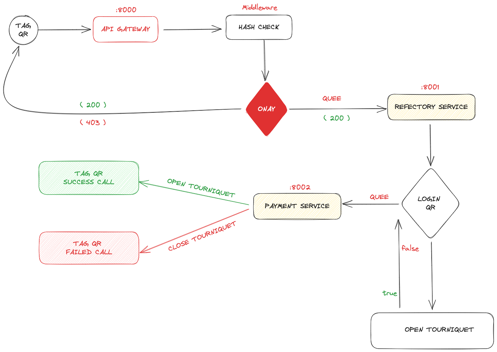

# Refectory MicroService

Microservice API development that enables turnstile management of a dining hall with two turnstiles.

## Definitions

**Alternative SuperApp**; In the simplest terms, it is a wallet mobile application that allows users to pre-load their balance and spend it in certain places.

**Tag-QR**; With the alternative SuperApp, it integrates external systems using QR code and enables payment. For example, the user has to go through the turnstile in order to enter an area, there is a QR on the turnstile and the user enters the Make Payment section of the mobile application and reads the QR, confirms the amount, the turnstile opens and the toll is deducted from the user's balance.

## Requirements

**Microservice API that provides turnstile management of a cafeteria with two turnstiles** is requested.

- You can enter the cafeteria maximum 50 times in a day.
- A user must have 2 passes per day.
- Since the payment will be received via Alternative SuperApp, it must be integrated into the Tag-QR system as described in the https://docs.altpay.dev/ document.
- Must be developed using Laravel.

 

